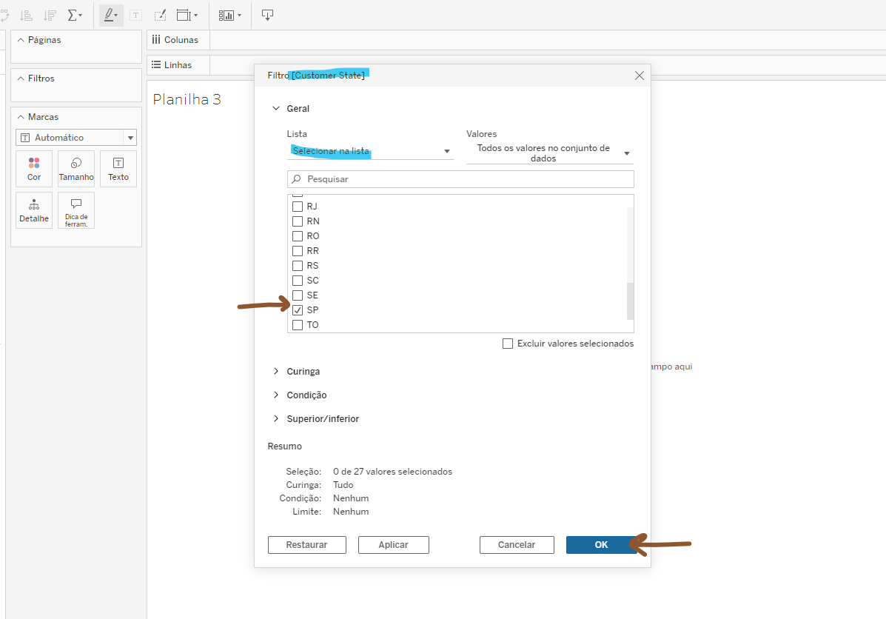
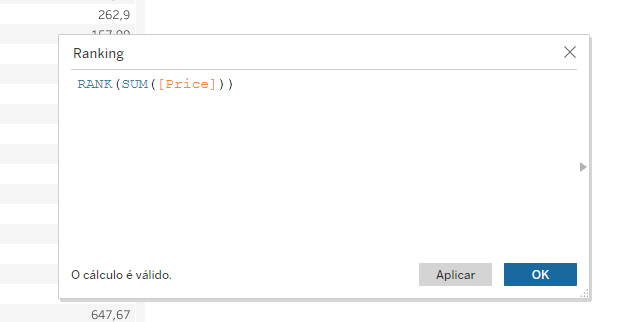
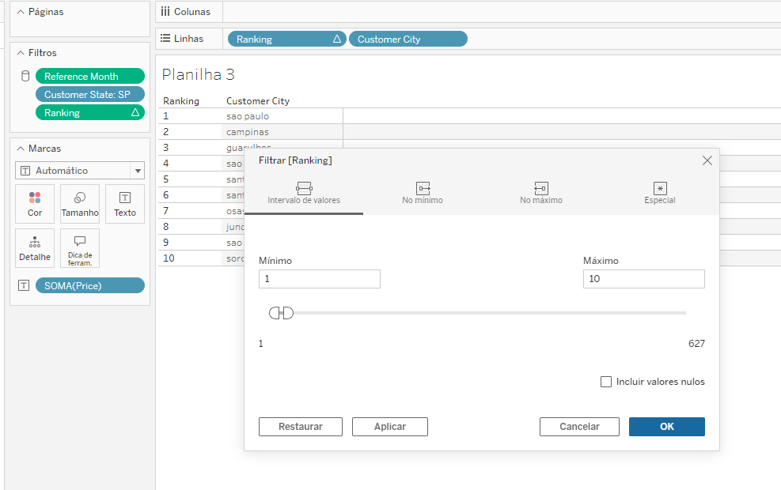

## Prática: Construíndo visualizações no Tableau Public (Parte 1): Gráficos
Agora que entendemos um pouquinho melhor como o Tableau funciona, podemos explorar um pouco melhor os tipos de gráficos que temos. Para fazer isso, vamos explorar melhor o estado de São Paulo?

Adicionando uma nova planilha, vamos garantir que estamos filtrando somente os dados de São Paulo. 


Para essa parte da aula, o objetivo é criar 4 visualizações diferentes:
1. Ranking Top 10 cidades de SP c/ melhor desempenho
2. Evolução de Vendas por Cidade
3. Número de Pedidos + Status de Entrega

Para a primeira visualização, iremos trazer o campo de Cidade para linhas, e arrastar o campo Price para o campo de Texto: 


Para trazermos as 10 cidades com mais vendas, precisamos criar um "Campo Calculado" utilizando a função Rank. Que irá ordenar as cidades de acordo com a variável que iremos escolher, no caso, a soma de Price. 

Para criar um campo calculado, clique com o botão direito no campo Price: 
. 

Essa ação cria um pop-up onde damos um nome a esse campo novo, iremos chamar de Ranking, e logo abaixo inserimos o nosso cálculo. 
.

`RANK(SUM([Price]))`

Com o campo calculado criado, podemos arrastar esse campo ao lado do campo de Cidade nas Linhas. Precisaremos ajustar esse campo para Discreto. E por fim, teremos o nosso ranking: 


Agora basta trazer o campo de Ranking para filtros e filtrar somente os 10 primeiros. 


Agora, precisamos fazer mais alguns cálculos. Quantos pedidos foram realizados em cada cidade? Quantos itens? 

Para calcular os pedidos, crie um campo calculado chamado Pedidos, com o seguinte cálculo: 
`COUNTD([Order Id])`

E para calcular o Ticket Médio, ou seja, o valor médio dos pedidos:
`SUM([Price])/Pedidos`

Assim, finalizamos nossa primeira visualização:


A nossa segunda visualização é a evolução de vendas por cidade: 


Nossa próxima e última visualização, iremos entender um pouco melhor sobre o Status da Entrega. Realizamos esse cálculo na nossa Análise Exploratória, porém não trouxemos a coluna calculada para tabela final, então, vamos fazer um campo calculado para isso!

Na aula anterior, o cálculo que fizemos para chegar nesse status foi:
```
df_olist.loc[df_olist['order_delivered_date'] > df_olist['shipping_limit_dt'], 'status_entrega'] = 'ATRASADO'
df_olist.loc[df_olist['order_delivered_date'] < df_olist['shipping_limit_dt'], 'status_entrega'] = 'ADIANTADO'
df_olist.loc[df_olist['order_delivered_date'] == df_olist['shipping_limit_dt'], 'status_entrega'] = 'DENTRO DO ESPERADO'
```

Vamos replicar isso no Tableau:
```
IF [Order Delivered Customer Date] > [Shipping Limit Date] THEN 'ATRASADO'
ELSEIF [Order Delivered Customer Date] < [Shipping Limit Date] THEN 'ADIANTADO'
ELSE 'DENTRO DO ESPERADO'
END
```

Campo calculado pronto, vamos fazer nossas visões!
Traga os campos status_entrega e o de Pedidos para Linhas ou Colunas, tanto faz! Clique no canto superior direito "Mostre-me" e altere a visualização para o mapa de árvores: 


E dessa forma, teremos a seguinte visualização por área: 


Agora, vamos fazer algumas melhorias. Trazer os números para a visualização e trazer seus percentuais também!


Porém, apesar desse campo agora ser de porcentagem, ainda não conseguimos ver os números. Para isso, clicando em Ctrl, arraste o campo AGREG(Pedidos) para o campo de rótulos. Assim, teremos uma viz final assim: 


Finalizamos as visões, vamos praticar? 

## Dinâmica: Exercícios Práticos: criando visualizações
Para essa dinâmica, vocês devem replicar a ideia que usamos para fazer nossas visualizações, porém, para outros estados! Vocês irão fazer 3 visualizações: 
1. Ranking Top 10 cidades do estado de sua escolha
2. Evolução de Vendas por Cidade
3. Número de Pedidos + Status de Entrega

E irão criar alguns campos calculados para gerar essas visões, como:
1. Número de pedidos
2. Status de Entrega
3. Ticket Médio

A ideia da dinâmica é que vocês explorem outras formas de dispor essas informações. Por exemplo, para o Ranking criamos uma tabela, essa informação poderia ser um gráfico? Quais outras formas que podemos passar a mensagem do Top 10 cidades? 